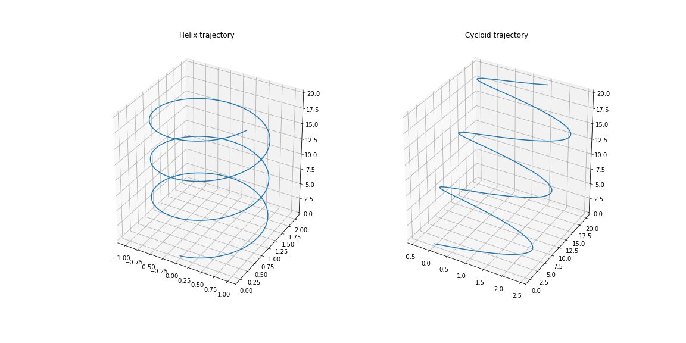
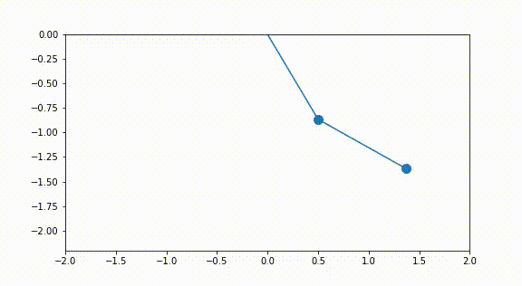

# Runge-Kutta method

Runge-Kutta method is a numerical technique to solve initial value ODEs by temporal discretization. The function RK44.py can be used to solve two coupled second order equations. The equations must be decoupled to four first order equations.

The RK method of order 4 is used to solve for the path of a charged particle in an electromagnetic field and simulating a double pendulum system.

## Path  of a charged particle

A charged particle in an electromagnetic field is a second order system. Its governing differential equation is given by the Lorentz force equation -

Assuming  and , we get - 

We decouple them by considering , ,  and . Then, we define the functions as - 

These functions and the initial positions and velocities are passed to the RK44 function, which returns the updated position and velocity vectors along the path. We call charge(0,1) and charge(1,1) to plot helix and cycloid trajectories respectively.

## Double Pendulum

Let the angles made by the vertical by the upper and lower pendulum be  and  respectively. The lagrangian of the double pendulum system is - 

Using the Euler-Lagrange equation , we get the following equations -

We decouple them as in the previous example and call the RK44 function with initial angles as 30 and 60 degrees. Below is the gif obtained using the matplotlib animation package -

