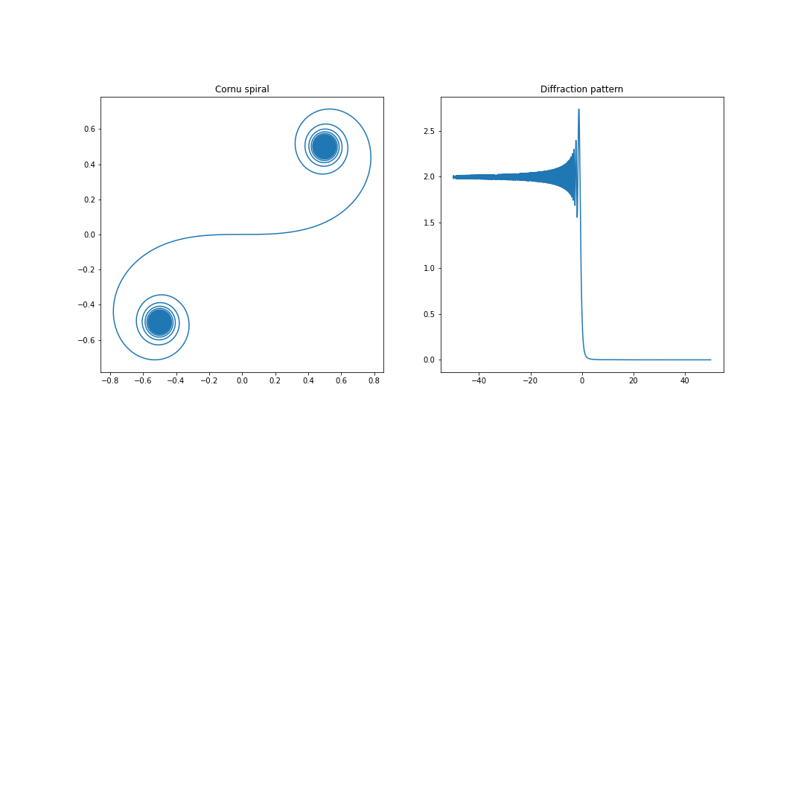

# Simpson method

This method is used to approximate definite integrals by quadratic interpolation. The function Simpson.py takes in the function to be integrated, the integration limits and the number of discrete steps as arguments and returns the answer.

## Diffraction pattern

The parametric curve known as Cornu's spiral is given by -

with . Here, we take , which gives us enough data points.

The intensity due to diffraction at a sharp edge is plotted using - 

